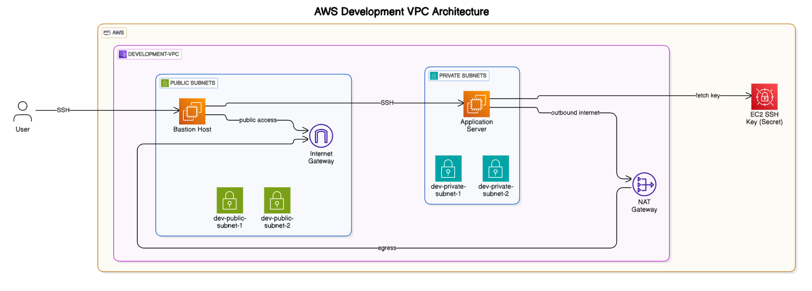

# Terraform - AWS Infrastructure

This repository contains Terraform configurations to provision AWS infrastructure.

## Features

- Automate the provisioning of AWS resources.
- Maintain and scale infrastructure efficiently.
- Version-controlled Infrastructure as Code (IaC).

## Prerequisites

- [Terraform](https://www.terraform.io/) installed on your machine.
- AWS CLI configured with appropriate credentials.

## Setup Instructions

1. Clone the repository:
   ```bash
   git clone https://github.com/AHMEDMOSSAD29/terrafrom.git
   cd terrafrom
   ```

2. Initialize Terraform:
   ```bash
   terraform init
   ```

3. Plan the infrastructure changes:
   ```bash
   terraform plan
   ```

4. Apply the changes:
   ```bash
   terraform apply
   ```

 ## Diagram
 - 


-----------------------------------------------------------------------------------------------
-Here's a complete step-by-step guide to run Ansible playbooks from your local machine through a bastion host to private EC2 instances:

Prerequisites
-Terraform has created infrastructure (bastion + private EC2)

-Private key is saved locally as admin.pem (from previous steps we save it from secrets manger into our machine as admin.pem)

-Ansible installed on your local machine

### Step 1: Configure SSH Access

Create/update ~/.ssh/config:
   Host bastion
  HostName <BASTION_PUBLIC_IP>
  User ubuntu
  IdentityFile ~/.ssh/admin.pem

Host *.private
  User ubuntu
  IdentityFile ~/.ssh/admin.pem
  ProxyCommand ssh -W %h:%p bastion

### Step 2: Create Ansible Inventory
   inventory.ini;
   [bastion]
<BASTION_PUBLIC_IP>

[private_servers]
<PRIVATE_EC2_1_IP> ansible_ssh_common_args='-o ProxyCommand="ssh -W %h:%p -q ubuntu@<BASTION_PUBLIC_IP> -i admin.pem"'

[private_servers:vars]
ansible_user=ubuntu
ansible_ssh_private_key_file=admin.pem

### Step 3: Test Connection;
   ansible private_servers -i inventory.ini -m ping
